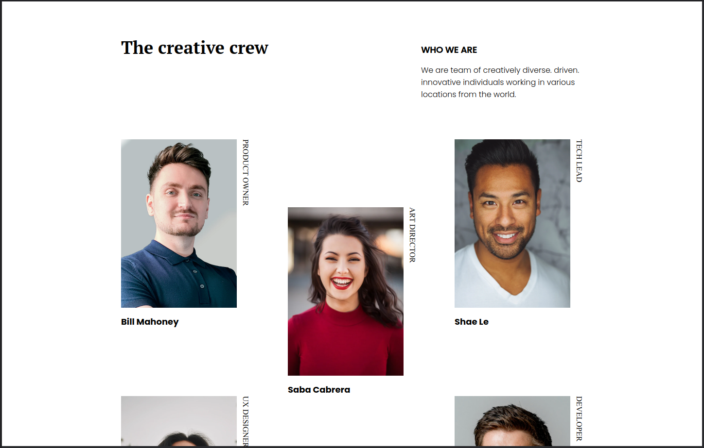
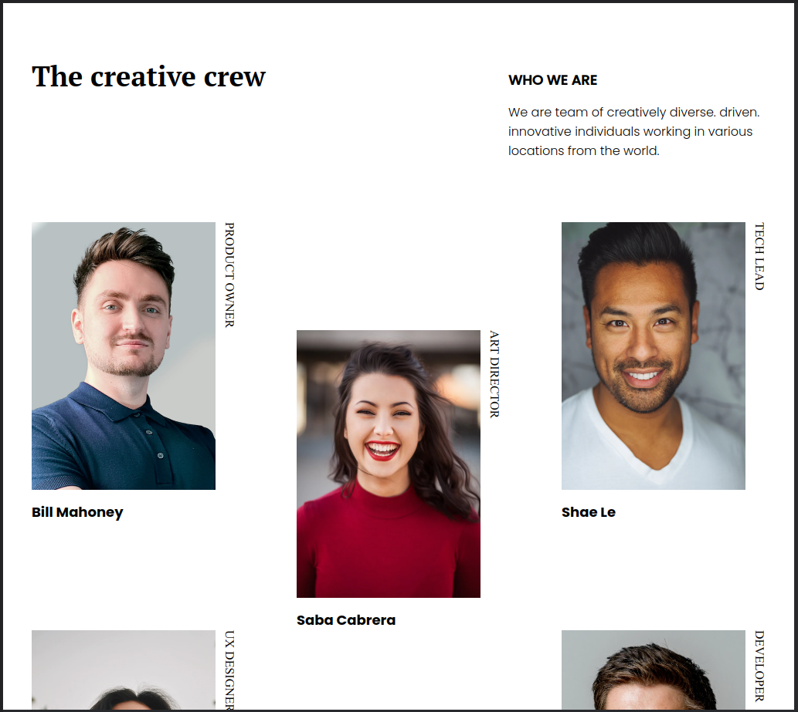
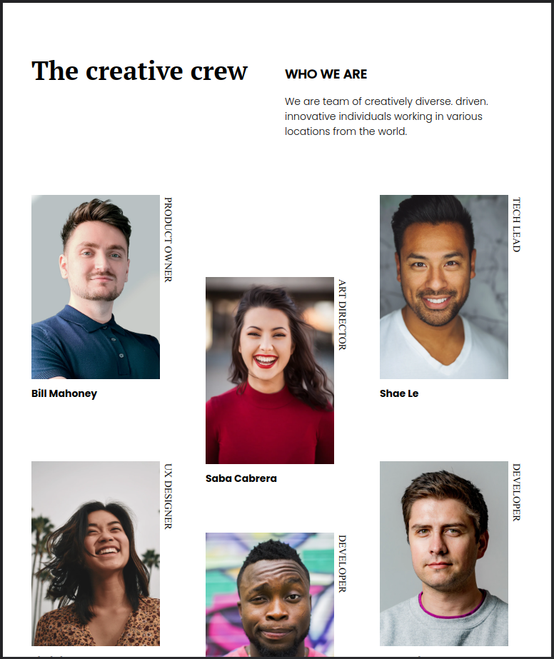
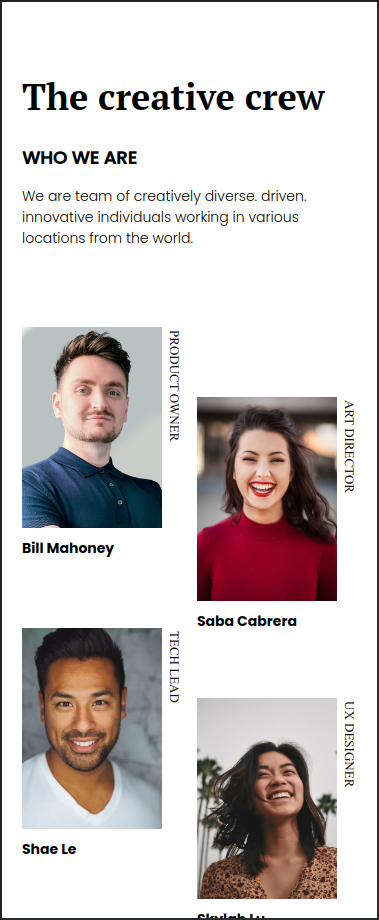

<!-- Please update value in the {}  -->

<h1 align="center">My team page</h1>

   Solution for a challenge from  <a href="http://devchallenges.io" target="_blank">Devchallenges.io</a>.

  <h3>
    <a href="https://estivenpinillo.dev/my-team-page-master/index.html">
      Solution
    </a>
     | 
    <a href="https://devchallenges.io/challenges/hhmesazsqgKXrTkYkt0U">
      Challenge
    </a>
  </h3>

<!-- TABLE OF CONTENTS -->

## Table of Contents

- [Overview](#overview)
- [Built With](#built-with)
<!-- OVERVIEW -->

## Overview

Screen 1440px

Screen 1024px

Screen 768px

Screen 375px

### Built With

- HTML5
- CSS3